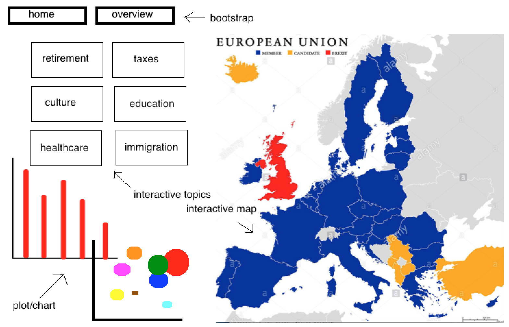

Design

# List of Data Sources

Employment
http://ec.europa.eu/eurostat/tgm/table.do?tab=table&init=1&language=en&pcode=t2020_10&plugin=1

Research and Development
http://ec.europa.eu/eurostat/tgm/table.do?tab=table&init=1&language=en&pcode=t2020_20&plugin=1

Climate Change and Energy

greenhouse gas emission: http://ec.europa.eu/eurostat/tgm/table.do?tab=table&init=1&language=en&pcode=t2020_30&plugin=1

energy consumption: http://ec.europa.eu/eurostat/tgm/table.do?tab=table&init=1&language=en&pcode=t2020_34&plugin=1

Education:
http://ec.europa.eu/eurostat/tgm/table.do?tab=table&init=1&language=en&pcode=t2020_41&plugin=1

GDP per Capita:
http://ec.europa.eu/eurostat/tgm/table.do?tab=table&init=1&language=en&pcode=sdg_08_10&plugin=1

(Reduced) Inequalities:
Purchasing power adjusted GDP per capita: http://ec.europa.eu/eurostat/tgm/refreshTableAction.do?tab=table&plugin=1&pcode=sdg_10_10&language=en

Asylum:
http://ec.europa.eu/eurostat/tgm/refreshTableAction.do?tab=table&plugin=1&pcode=sdg_10_60&language=en

EU Financing to Developing Countries:
http://ec.europa.eu/eurostat/tgm/refreshTableAction.do?tab=table&plugin=1&pcode=sdg_17_20&language=en

EU Imports from Developing Countries:
http://ec.europa.eu/eurostat/tgm/table.do?tab=table&init=1&language=en&pcode=sdg_17_30&plugin=1

# Diagram

# Description

Map of Europe: clicking a country will affect the chart/plot (currently barchart, possibly some other chart/plot). Onclick on the map adds/deletes a country to/from the chart/plot.

Political topics: Onclick on a topic will alter the chart/plot according to the selected topic. Also some external (pop-up) window or bootstrap implementation will be added with some more information on the selected topic. Possibly one or more pie charts may be added to substantiate this information

Slider: toggles through the years of the dataset

Chart/plot: barchart or scatterplot which will shown data of the selected country and topic, and in all cases data of the netherlands for comparisson. 

All the visualizations will be created using svg elements based on d3.
The data will be stored in different csv and json files.

# Plugins:

d3-slider

d3-tip

bootstrap

