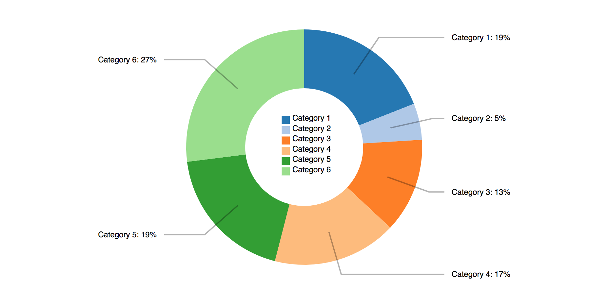
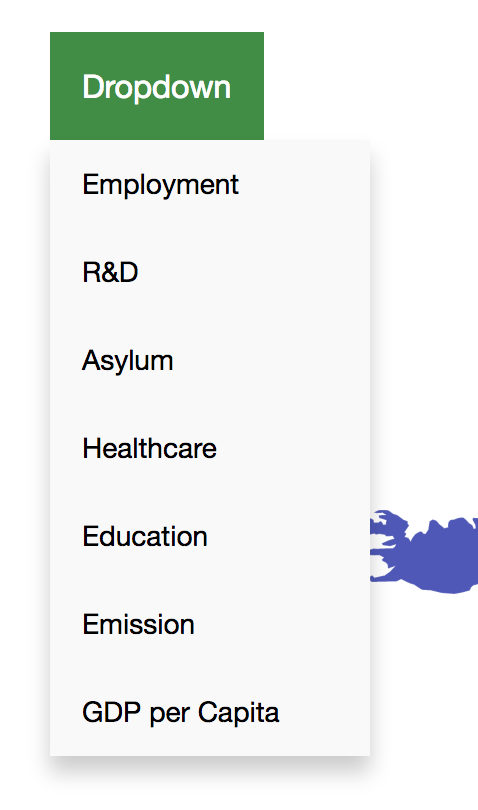
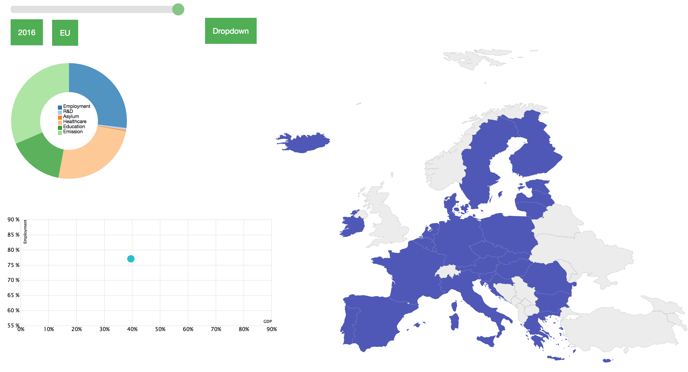

# day 1

Voor de vizualisatie van de scatterplot, die voor x as gebaseerd is op GDP per capita, voor de y as gebaseerd op de geselecteerde topic (voor de testfase in dit geval employment), en voor de grote van de dots gebaseerd op population van een land, zijn 3 verschillende data files die worden ingeload bij de queue() nodig. Maar .data() kan maar 1 file inloaden, dus hier moet wat op gevonden worden.

Verder zijn de mousover en mouseout functies toegevoegd aan de landen van de map, waardoor de opacity van het gehoverde land van 0.7 naar 1.0 veranderd. 

# day 2

Op de manier zoals gedacht was om uit verschillende data files waardes te gebruiken om dots te maken voor de scatterplot is niet mogelijk. Er moet nu worden overgegaan op het schrijven van meerdere csv files voor alle jaren, die elk alle variabelen voor een land in dat jaar bevatten.

# day 3

Voor de jaren 2014, 2015 en 2016 zijn nu CSV files gemaakt waarin enkele van de beoogde waardes voor de final version zijn opgenomen. De slider geeft de een output waarde van het geselecteerde jaar, en deze waarde wordt nu doorgegeven naar de queue() om het bijbehorende CSV file te loaden. Ook is er een update functie toegevoegd waardoor de map en de plot opnieuw worden gemaakt wanneer er van jaar wordt veranderd. (Deze zal ook moeten worden gebruikt wanneer er van topic wordt veranderd.) Wat nu problemen oplevert is de svg elementen horizontaal naast elkaar uitlijnen.

https://www.w3schools.com/howto/howto_js_rangeslider.asp

# day 4

Het probleem van de svg's horizontaal naast elkaar uitlijnen is gedeeltelijk opgelost. De scatterplot en en de map kunnen respectievelijk links en rechts van elkaar worden gepositioneerd. Alleen de scatterplot valt nu op de plek die bestemd is voor de visualisatie van de topics. 

# day 5

Het probleem van de uitlijnen van de svg's is nu volledig opgelost. De scatterplot en de map staan op hun definitieve positie, en de ruimte voor de visualisaties van de topics is vrijgemaakt (deze is tijdelijk opgevuld met wat test div.) Over die visualisatie van de topics is wel een nieuw probleem opgekomen. De manier die voor ogen was, met de verschillende topics in vakken die als het ware radio buttons zijn, voldoet niet aan een visualisatie. Een goed alternatief voor hiervoor moet nu dus bedacht worden, maar dit blijkt lastiger dan op voorhand gedacht met huidige data die tot beschikking is.

# day 6

Uit de feedback van zowel de presentaties als van de daily standup is het idee naar voren gekomen om de visualisatie van de topics te verwerken in een pie chart, die ten eerste de verhouding van de verschillende topics ten opzichte van elkaar aangeeft. De slices van de pie chart zouden dan ook kunnen dienen als de radio buttons. Er moeten nu meer data files worden gemaakt of bewerkt die als input voor de pie chart kunnen dienen, en ook is er gezocht naar een template pie chart.

http://bl.ocks.org/juan-cb/1984c7f2b446fffeedde

# day 7

De code voor de donut chart is grotendeels geschreven met vooralsnog testwaarden voor de verschillende topics. De chart kan makkelijk worden toegevoegd aan een nieuwe svg in een aparte div op de plek die daarvoor was vrijgehouden. Het uitlijen verloopt nu een stuk makkelijker dan toen hier voor het eerst tegen problemen werden aangelopen. Nu is nog een probleem dat de chart moet worden geupdate.

# day 8

De update functie is op aangepast zodat nu ook de donut chart wordt verwijderd en opnieuw aangemaakt. Het grootste probleem is nu bedenken wat er precies moet worden weergeven in de donut chart; representatieve en relevante informartie die aansluiten bij de probleemstelling. Ook is het niet voldoende om de slices van de donut chart als radio buttons te hebben, er zal nog een tweede html element bij moeten komen naast de slider alleen. In deze twee problemen is veel denkwerk gaan zitten.

# day 9

Na overleg met de begeleiders is besloten om een dropdown te gebruiken als 2e html element. De dropdown moet dan de topics bevatten waarop geselecteerd kan worden. Als template is de dropdown van w3schools gebruikt. Wanneer een topic is aangeklikt, moet de x-as van de scatterplot naar deze waarde worden aangepast. Hierdoor is de interactiviteit tussen de topics donutchart en de scatterplot echter verloren gegaan, en hiervoor moet dus wel iets nieuws bedacht worden. De oplossing is het oude idee, waarbij de slices van de chart als radio buttons dienen, alsnog gebruiken en dan toepassen op de y-as van de scatterplot. Op deze manier kan je ook 2 topics tegen elkaar uitzetten, in plaats van alleen een bepaalde topic tegen het GDP. 

https://www.w3schools.com/css/css_dropdowns.asp

# day 10

Uit de feedback van de presentaties kwam het geluid naar voren dat er nog interactie tussen de map en de donut chart ontbrak. De oplossing hiervoor is dat de donut chart default op EU begint, en wanneer een land op de map wordt aangeklikt de donut chart de waarden van dit land weergeeft. Verder was er op deze dag de Carbon Masterdag in Utrecht dus was er verder geen tijd meer om verder te werken. 

# day 11

De dropdown is toegevoegd, op de juiste plek uitgelijd en de functionaliteit is volledig geimplementeerd.

Daarnaast is ook de interactie tussen de map en de donut chart volledig geimplementeerd. Wanneer een land wordt aangeklikt wordt de donut chart geupdate voor dat land. Echter hiervoor waren wel data nodig van het specifieke land, en niet langer de testwaarden die werden gebruikt voor de donutchart. Op het probleem welke relevante data gebruikt moest worden is nu een oplossing gevonden, en alle data files voor elke jaar, van 2008 tot 2016, waarin waarden voor elk land zijn opgenomen, en de file voor de EU, waarin elk jaar is opgenomen, zijn ook volledig afgemaakt.

# day 12

Nieuwe feedback raadde aan om 2 knoppen te maken bij de scatterplot om alle landen toe te voegen en te verwijderen, omdat dit nu nog alleen kon door alle landen afzonderlijk aan te klikken. Ook is er met behulp van w3 schools een bootstrap navbar gemaakt, die de home pagina, die het project bevat, en een about, story en reference pagina bevat. Verder zijn de story en about pagina opgemaakt met text wells en jumbotrons, andere bootstrap eigenschappen die gevonden kunnen worden op w3schools. 

https://www.w3schools.com/bootstrap/default.asp

# day 13

Een achtergrond is toegevoegd aan de home pagina, met een lage opacity, zodat de grafieken en de map wel duidelijk zichtbaar blijven, maar dat er niet een kale witte achtergrond is. Hiervoor is gekozen om de afbeelding te downloaden in png format en de opacity handmatig aan te passen, omdat dit een makkelijkere operatie is en de afbeelding altijd lokaal bereikbaar is.

Verder zijn er nog kleine opmaak dingetjes verandert op de story en about pagina's en is de code in de html, css en js files netter gemaakt en voorzien van enkele comments. 

# day 14

De laatste dag is gebruikt voor het net maken van de repository en het afschrijven van alle andere bestanden, zoals het DESIGN.md, PROCESS.md en README.md.