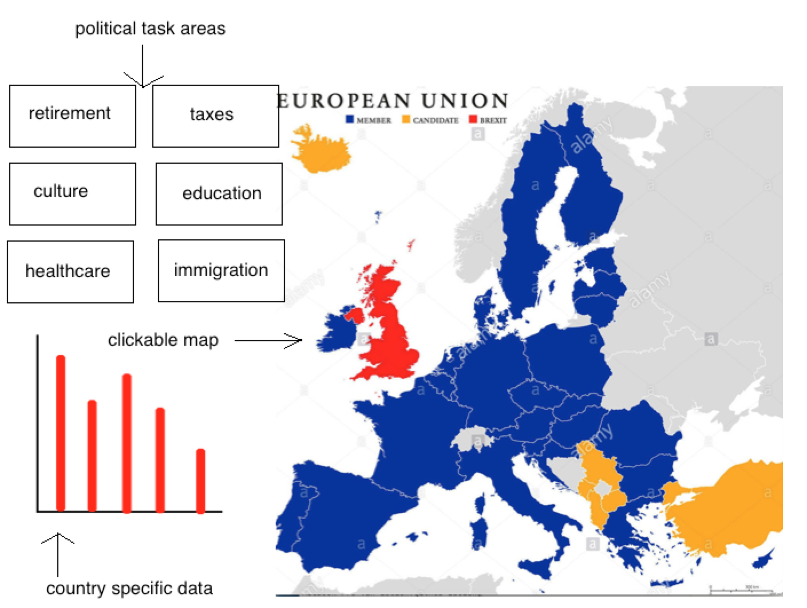
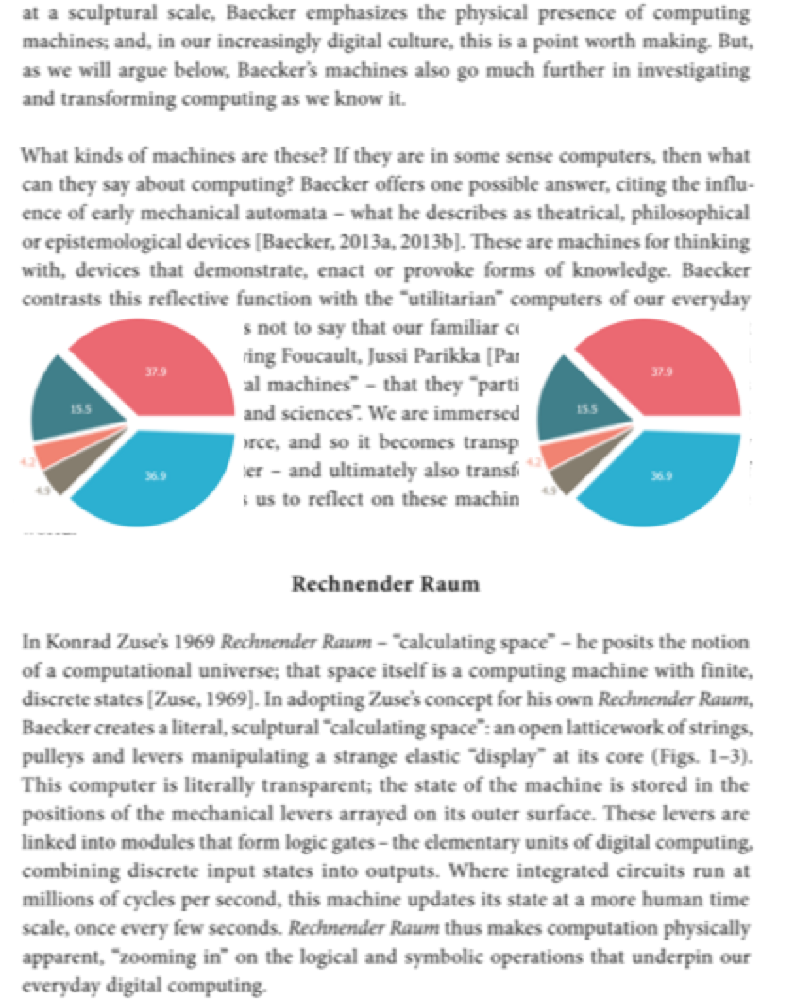

# Project
This repository contains all content of the programming project

# Problem Statement
Nowadays there is a lot of discussion in Dutch politics: leave or stay in the European Union. But in fact a lot of ambiguity is noticable among the Dutch population about what the EU exactly does, and what role it plays for the Netherlands and the Netherlands pays for it. To clearify this ambuguity the idea is to make an interactive visualization about the EU: about what topics revolves European politics and which amounts of money are involved. 

# Solution
This visualization will give insight in the acts of the EU and thus contribute to bring more nuance about European politics among the Dutch voters.

The sketches of the product show an interactive map, which will contain all the members states of the EU. Clicking on the map will update some sort of data visualization (currently shown as barchart, but this might be a subject to change) of the selected country. Also a list of (popular) political task areas is shown in the project which will be clickable, which will show information as shown in the second sketch. How this visualization will be implemented is unclear, possibly based on some sort of bootstrap idea. 

So the main features will be:
- clickable interactive map
- updated data visualization (for example a barchart)
- clickable politcal themes, activating a pop-up/bootstrap/page

All these features will define the MVP.

# Prerequisites
Data Sources
Some data might need to be transformed before being usable
https://www.prodemos.nl/leer/informatie-over-politiek/de-europese-unie/doet-europese-unie/
https://www.europa-nu.nl/id/vh9w9l2qtnwn/nederlandse_afdrachten_aan_de_eu
https://www.rijksoverheid.nl/onderwerpen/europese-unie
http://ec.europa.eu/eurostat/data/database

External Components
- Bootstrap

Similar
http://bl.ocks.org/oscar6echo/4423770
http://bl.ocks.org/erichoco/6694616

Hardest Part
- transforming the data in such a way it wil represent the purpose of the project, so letting the data give relevant meaning to the visualizations
- implementing the interaction to the map or political themes and the data in a correct way.

