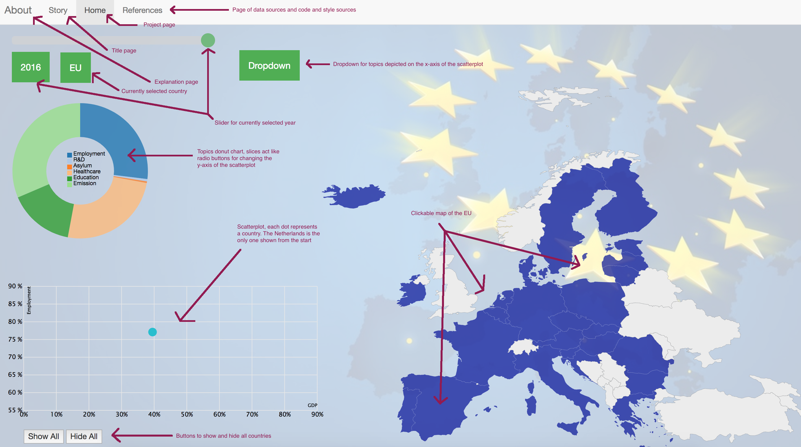

# Project
This repository contains all content of the programming project

# [Github Pages](https://lucienkoenekoop.github.io/Project/story.html)

# Problem Statement
Nowadays there is a lot of discussion in Dutch politics: leave or stay in the European Union. But in fact a lot of ambiguity is noticable among the Dutch population about what the EU exactly does, and what role it plays for the Netherlands and the Netherlands plays for it. To clearify this ambiguity the idea is to make an interactive visualization about the EU: about what topics revolves European politics and which amounts of money are involved. 

# Solution
This visualization will give insight in the acts of the EU and thus contribute to bring more nuance about European politics among the Dutch voters.

This image of the page shows all the functionality that is implemented on the site. With the navbar can be toggled thourgh the different pages. On the home page, the scatterplot can be altered by clicking a country on the map, clicking a topic on the topics donut chart, by clicking another topic in the dropdown menu or by selecting another year with the slider. 

# Prerequisites
Data Sources
- https://www.prodemos.nl/leer/informatie-over-politiek/de-europese-unie/doet-europese-unie/
- https://www.europa-nu.nl/id/vh9w9l2qtnwn/nederlandse_afdrachten_aan_de_eu
- https://www.rijksoverheid.nl/onderwerpen/europese-unie
- http://ec.europa.eu/eurostat/data/database

External Components
- Bootstrap

Acknowledgements
- http://bl.ocks.org/oscar6echo/4423770
- http://bl.ocks.org/erichoco/6694616
- https://www.w3schools.com/howto/howto_js_rangeslider.asp
- http://bl.ocks.org/juan-cb/1984c7f2b446fffeedde
- https://www.w3schools.com/css/css_dropdowns.asp
- https://www.w3schools.com/bootstrap/default.asp

Images
- https://www.binarytree.com/media/2832/european-union-gdpr.jpg
- https://i1.wp.com/geoawesomeness.com/wp-content/uploads/2017/03/european-union-brexit-political-map-with-european-union-member-states.jpg