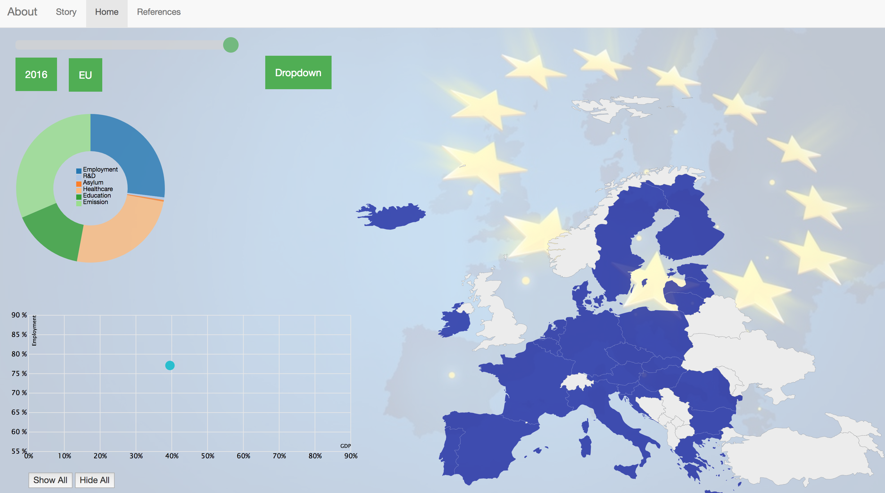

# Description

This project will help to clearify the ambiguity of the European Union amongst the Dutch population about what the EU exactly does, by visualizing data of main political topics and the contribution of all individual countries.

# Design

The main feature of the project is the scatterplot. This plot images the relation bewteen different topics and characteristics of the individual countries of the EU. In the project.js file in the project funtion the data is 

# Challenges

# Decisions

# Reflection
